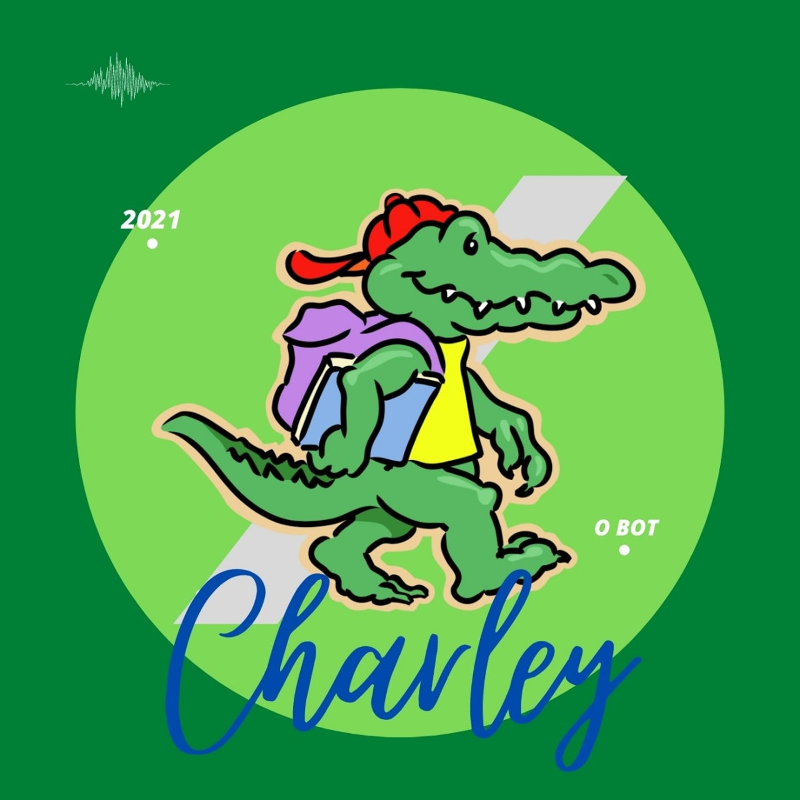

<h2 align="center">
  
</h2>
<h1 align="center">Bot</h1>

<!-- [badges] [badges] [badges] [badges]  -->

## 💻 Visão Geral
O Charley Bot propõe-se a ajudar a combater a pandemia de COVID-19 facilitando a 
divulgação de importantes informações através de um bot que responderá as mais 
frequentes duvidas.
	

## 💡 Ideia e Incentivo
Com o decorrer da pandemia percebemos a preocupante e crescente desinformação da
população, e quando tal fato está relacionado a uma pandemia global é 
extremamtente perigoso. Por isso achamos necessária a divulgação de informações 
pertinenetes sobre a COVID-19 para informar a população e, de alguma forma, 
ajudar na briga mundial contra o vírus.

<!-- ## ⚙️ Funcionalidades
- [x] Checkbox:
  - [x] Sub-Checkbox
    - Tópico 1
    - Tópico 2 -->

<!-- ## 📦 Releases 1 e 2
  Release 1 - 2 de setembro
  
  Release 2 - 26 de outubto -->

<!-- ## 🚀 Como executar o projeto
### 🛠 Tecnologias e Pré-Requisitos
-

### ✔️ Instalando e Executando
- -->

<!-- ## 🤝 Como contribuir para o projeto

Guia de Contribuição

Código de Conduta

Como rodar o projeto

Políticas de Contribuição

Template para criação de issues

Template para criação de pull requests -->

## 👨‍💻 Desenvolvedores
<table class="tg">
<thead>
  <tr>
    <th class="tg-0pky"></th>
    <th class="tg-0pky">Capivara :ox:</th>
    <th class="tg-0pky">PlusUltra :fleur_de_lis:</th>
    <th class="tg-0pky">Slowbrows :pig2:</th>
  </tr>
</thead>
<tbody>
  <tr>
    <td class="tg-0pky">Desenvolvedor</td>
    <td class="tg-0pky" style="text-align: center;" >    <a href="https://github.com/MegahNevel"> Eduardo Levenhagem</a></td>
    <td class="tg-0pky" style="text-align: center;" >    <a href="https://github.com/DouglasMonteles">Douglas Monteles</a></td>
    <td class="tg-0pky"></td>
  </tr>
  <tr>
    <td class="tg-0pky">Desenvolvedor</td>
    <td class="tg-0pky" style="text-align: center;" >   <a href="https://github.com/LamequeFernandes">Lameque Fernandes </a> </td>
    <td class="tg-0pky" style="text-align: center;" > ">   <a href="https://github.com/Ericklevy">Erick Levy</a></td>
    <td class="tg-0pky" style="text-align: center;" > ">   <a href="https://github.com/kayrocesar">Kayro César</a></td>
  </tr>
  <tr>
    <td class="tg-0pky">DevOps</td>
    <td class="tg-0pky" style="text-align: center;" >    <a href="https://github.com/Thais-ra">Thais Rebouças</a></td>
    <td class="tg-0pky" style="text-align: center;" >    <a href="https://github.com/yudi-azvd">Yudi Yamane</a></td>
    <td class="tg-0pky" style="text-align: center;" >    <a href="https://github.com/LuizPettengill">Luiz Petengill</a> </td>
  </tr>
  <tr>
    <td class="tg-0pky">Arquiteto</td>
    <td class="tg-0pky" style="text-align: center;" >    <a hre="https://github.com/klmurussi"> Kathlyn Lara</a> </td>
    <td class="tg-0pky" style="text-align: center;" >    <a href="https://github.com/victorear05">Victor Eduardo</a></td>
    <td class="tg-0pky" style="text-align: center;" >    <a href="https://github.com/matheusrazor">Matheus Rapahel</a></td>
  </tr>
  <tr>
    <td class="tg-0pky">Product Owner</td>
    <td class="tg-0pky" style="text-align: center;">  <a href="https://github.com/AnaCarolinaRodriguesLeite"> Ana Carolina </a></td>
    <td class="tg-0pky" style="text-align: center;" >    <a href="https://github.com/PedroLSF">Pedro Lucas</a></td>
    <td class="tg-0pky" style="text-align: center;" >    <a href="https://github.com/matheusakio">Matheus Akio</a></td>
  </tr>
  <tr>
    <td class="tg-0pky">Scrum Master</td>
    <td class="tg-0pky" style="text-align: center;" >    <a href="https://github.com/gatotabaco">Matheus Sousa</a> </td>
    <td class="tg-0pky" style="text-align: center;" >    <a href="https://github.com/AmandaNbr">Amanda Nobre</a></td>
    <td class="tg-0pky" style="text-align: center;" >    <a href="https://github.com/HenriqueHida">Henrique Hida</a></td>
  </tr>
</tbody>
</table>

<small>Feito com <a href="https://www.tablesgenerator.com/html_tables">
  Tables Generator</a>.
</small>

## 📝 Licença
Este projeto está licenciado sob os termos da licença 
[GNU GPL v3.0](https://github.com/fga-eps-mds/2021-1-Bot/blob/improvement(%2398)/melhorar-readme/LICENSE).
