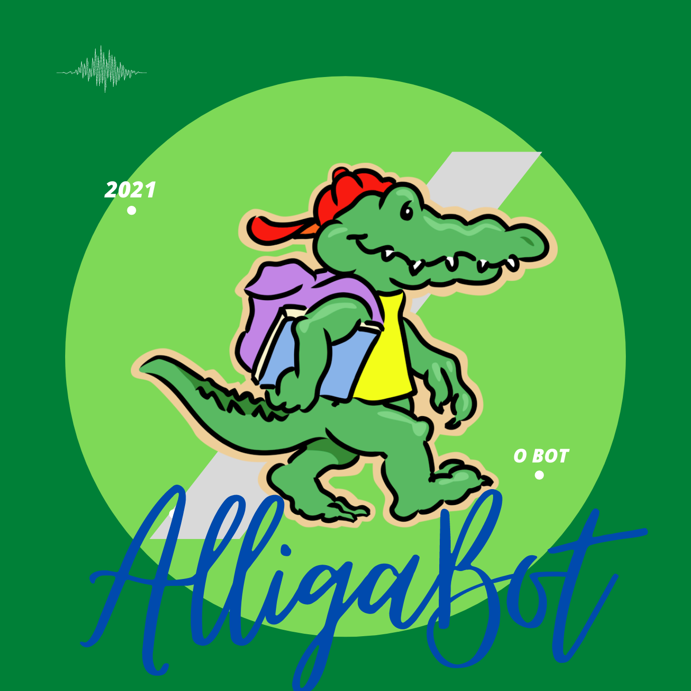

  

<h1 align="center">AlligaBot</h1>

<!-- [badges] [badges] [badges] [badges]  -->

## 💻 Visão Geral
O AlligaBot propõe-se a ajudar a combater desinformação
no contexto da pandemia do COVID-19, facilitando a  divulgação 
de informações importantes através de um chatBot que responderá as dúvidas
mais frequentes.
	

## 💡 Ideia e Incentivo
Com o decorrer da pandemia percebemos a preocupante e crescente desinformação da
população, e quando tal fato está relacionado a uma pandemia global é 
extremamente perigoso. Por isso achamos necessária a divulgação de informações 
pertinentes sobre a COVID-19 para informar a população e, de alguma forma, 
ajudar no combate mundial ao vírus.

<!-- ## ⚙️ Funcionalidades
- [x] Checkbox:
  - [x] Sub-Checkbox
    - Tópico 1
    - Tópico 2 -->

<!-- ## 📦 Releases 1 e 2
  Release 1 - 2 de setembro
  
  Release 2 - 26 de outubto -->

## 🚀 Como executar o projeto
### 🛠 Tecnologias e Pré-Requisitos
Esse projeto usa algumas ferramentas para o seu desenvolvimento:
- [Docker](https://docs.docker.com/get-docker/)
- [Docker Compose](https://docs.docker.com/compose/install/)
- [WSL](https://docs.microsoft.com/pt-br/windows/wsl/install-win10) para 
desenvolvimento em Windows 10
- [Make](https://www.gnu.org/software/make/)

### ✔️ Instalando e executando
Baixe o repositório e entre nele

    git clone https://github.com/fga-eps-mds/2021-1-Bot.git
    cd 2021-1-Bot

Faça build das imagens rodando o seguinte comando:

    make build 

Se esta é a su primeira vez executando esse comando, isso pode levar 
alguns minutos. Em seguida, treine o chatBot executando:

    make train

Para conversar com o chatBot, execute o seguinte:

    make shell

Não se esqueça de desligar os containers quando terminar sua sessão de
desenvolvimento. Para desligar os contêineres basta executar:

    make stop

Se você quiser adicionar novos diálogos ao chatBot você deve fazer alterações 
no arquivos `bot/domain.yml` e `bot/data/*.yml`, e, em seguida, deve treiná-lo
novamente:

    make train

## 🤝 Como contribuir para o projeto

[Guia de Contribuição](docs/CONTRIBUTING.md)

[Código de Conduta](docs/CODE_OF_CONDUCT.md)

[Política de Branches](docs/politicas/branches.md)

[Políticas de Commits](docs/politicas/commits.md)

[Template para criação de issues](.github/ISSUE_TEMPLATE/custom.md)

[Template para criação de pull requests](.github/pull_request_template.md)

## 👨‍💻 Desenvolvedores
<table class="tg">
<thead>
  <tr>
    <th class="tg-uzvj">Capivara :ox:</th>
    <th class="tg-uzvj">PlusUltra :fleur_de_lis:</th>
    <th class="tg-uzvj">Slowbrows :pig2:</th>
  </tr>
</thead>
<tbody>
  <tr>
    <td class="tg" style="text-align:center;">                <a href="https://github.com/AnaCarolinaRodriguesLeite" target="_blank" rel="noopener noreferrer"> Ana Carolina </a></td>
    <td class="tg" style="text-align:center;">                 <a href="https://github.com/AmandaNbr" target="_blank" rel="noopener noreferrer">Amanda Nobre</a></td>
    <td class="tg" style="text-align:center;">                 <a href="https://github.com/HenriqueHida" target="_blank" rel="noopener noreferrer">Henrique Hida</a></td>
  </tr>
  <tr>
    <td class="tg" style="text-align:center;">                 <a href="https://github.com/MegahNevel" target="_blank" rel="noopener noreferrer"> Eduardo Levenhagem</a></td>
    <td class="tg" style="text-align:center;">&nbsp;&nbsp;&nbsp;&nbsp;&nbsp;&nbsp;&nbsp;&nbsp;">&nbsp;&nbsp;&nbsp;&nbsp;&nbsp;&nbsp;&nbsp;&nbsp; <a href="https://github.com/Ericklevy">Erick Levy</a></td>
    <td class="tg" style="text-align:center;">&nbsp;&nbsp;&nbsp;&nbsp;&nbsp;&nbsp;&nbsp;&nbsp;">&nbsp;&nbsp;&nbsp;&nbsp;&nbsp;&nbsp;&nbsp;&nbsp; <a href="https://github.com/kayrocesar">Kayro César</a></td>
  </tr>
  <tr>
    <td class="tg" style="text-align:center;">                 <a href="https://github.com/klmurussi" target="_blank" rel="noopener noreferrer"> Kathlyn Lara</a></td>
    <td class="tg" style="text-align:center;">                 <a href="https://github.com/DouglasMonteles" target="_blank" rel="noopener noreferrer">Douglas Monteles</a></td>
    <td class="tg" style="text-align:center;">&nbsp;&nbsp;&nbsp;&nbsp;&nbsp;&nbsp;&nbsp;&nbsp;&nbsp;&nbsp;&nbsp;&nbsp;&nbsp;&nbsp;&nbsp;&nbsp; <a href="https://github.com/LuizPettengill">Luiz Petengill</a></td>
  </tr>
  <tr>
    <td class="tg" style="text-align:center;">                 <a href="https://github.com/LamequeFernandes" target="_blank" rel="noopener noreferrer">Lameque Fernandes </a></td>
    <td class="tg" style="text-align:center;">&nbsp;&nbsp;&nbsp;&nbsp;&nbsp;&nbsp;&nbsp;&nbsp;&nbsp;&nbsp;&nbsp;&nbsp;&nbsp;&nbsp;&nbsp;&nbsp; <a href="https://github.com/victorear05">Victor Eduardo</a></td>
    <td class="tg" style="text-align:center;">&nbsp;&nbsp;&nbsp;&nbsp;&nbsp;&nbsp;&nbsp;&nbsp;&nbsp;&nbsp;&nbsp;&nbsp;&nbsp;&nbsp;&nbsp;&nbsp; <a href="https://github.com/matheusrazor">Matheus Rapahel</a></td>
  </tr>
  <tr>
    <td class="tg" style="text-align:center;">                 <a href="https://github.com/gatotabaco" target="_blank" rel="noopener noreferrer">Matheus Sousa</a></td>
    <td class="tg" style="text-align:center;">&nbsp;&nbsp;&nbsp;&nbsp;&nbsp;&nbsp;&nbsp;&nbsp;&nbsp;&nbsp;&nbsp;&nbsp;&nbsp;&nbsp;&nbsp;&nbsp; <a href="https://github.com/PedroLSF">Pedro Lucas</a></td>
    <td class="tg" style="text-align:center;">&nbsp;&nbsp;&nbsp;&nbsp;&nbsp;&nbsp;&nbsp;&nbsp;&nbsp;&nbsp;&nbsp;&nbsp;&nbsp;&nbsp;&nbsp;&nbsp; <a href="https://github.com/matheusakio">Matheus Akio</a></td>
  </tr>
  <tr>
    <td class="tg" style="text-align:center;">                 <a href="https://github.com/Thais-ra" target="_blank" rel="noopener noreferrer">Thais Rebouças</a></td>
    <td class="tg" style="text-align:center;">                 <a href="https://github.com/yudi-azvd" target="_blank" rel="noopener noreferrer">Yudi Yamane</a></td>
    <td class="tg" style="text-align:center;"></td>
  </tr>
</tbody>
</table>
<small>Feito com <a href="https://www.tablesgenerator.com/html_tables">
  Tables Generator</a>.
</small>

## 📝 Licença
Este projeto está licenciado sob os termos da licença 
[GNU GPL v3.0](https://github.com/fga-eps-mds/2021-1-Bot/blob/main/LICENSE).

