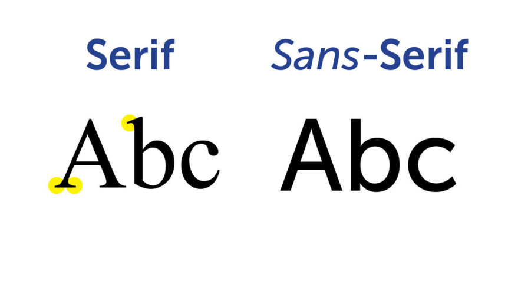

# Histórico de Revisão

| Data   | Versão | Modificação  | Autor  |
| :- | :- | :- | :- |
| 19/08/2021 | 0.1 | Criação da versão inicial do documento | Kathlyn Lara |
| 01/09/2021 | 0.2 | Logo do bot e paleta de cores | Kathlyn Lara |
| 04/09/2021 | 0.3 | Novo logo do bot | Kathlyn Lara |
| 09/09/2021 | 0.4 | Fonte e paleta de cores nova | Kathlyn Lara |

# 1. Introdução

# 2. Apresentação da Identidade Visual

## Justificativa
Um jacaré amigável segurando uma seringa.

# 3. Fontes

Obs.: As fontes aqui citadas são da página github.io do AlliBot, já que o produto em si irá utilizar as fontes padrão da máquina (smartphone/notebook) do usuário.

A fonte utilizada na aplicação será:

 - **Poppins**(SIL OPEN FONT LICENSE Version 1.1)

Esta fonte é sans-serif, facilitando a leitura para pessoas com dislexia, já que são "sem serif", isto é, não possui traços e hastes rebuscadas.

Além disso, estas fontes possuem boa adaptação para aplicações responsivas, como o deste projeto, adaptando-se para visualização web e mobile e também possuem licença que permite uso gratuito.

## Uso das fontes

### Incluindo no HTML

Coloca-se no <head> o seguinte trecho de código:

	<link href="https://fonts.googleapis.com/css?family=Poppins" rel="stylesheet">

### Incluindo no CSS

Coloca-se no css, para a utilização das fontes:

	font-family: 'Poppins', sans-serif;

# 4. Paleta de cores
  
Obs.: As cores aqui citadas são da página github.io do AlliBot, já que o produto em si irá utilizar as cores padrão da máquina (smartphone/notebook) do usuário.

# 5. Referências
>[1. Acacia](https://github.com/fga-eps-mds/2019.2-Acacia/edit/develop/docs/style_guide.md)
  
>[2. Poppins](https://freebestfonts.com/yone/prev/poppins.jpg)
  
>[3. Sans Serif](https://newenglandrepro.com/wp-content/uploads/2016/08/BP-Serif-SansSerif-Graphic1-862x518.jpg)
