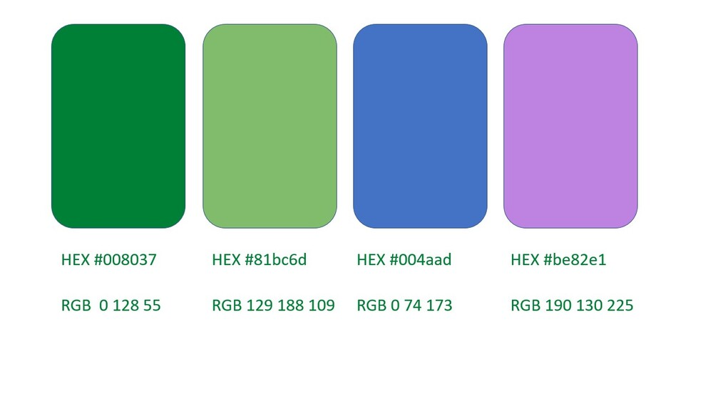

# Histórico de Revisão

| Data   | Versão | Modificação  | Autor  |
| :- | :- | :- | :- |
| 19/08/2021 | 0.1 | Criação da versão inicial do documento | Kathlyn Lara |
| 01/09/2021 | 0.2 | Logo do bot e paleta de cores | Kathlyn Lara |
| 04/09/2021 | 0.3 | Novo logo do bot | Kathlyn Lara |

# 1. Introdução

# 2. Apresentação da Identidade Visual

# 3. Fontes

## Uso das fontes

### Incluindo no HTML

### Incluindo no CSS

# 4. Paleta de cores

<!-- 
## 4.1 Componentes

### 4.1. Botões

### 4.2. Campos de formulários

### 4.3. Navbar
-->

# 5. Referências
>[1. Acacia]
(https://github.com/fga-eps-mds/2019.2-Acacia/edit/develop/docs/style_guide.md)
