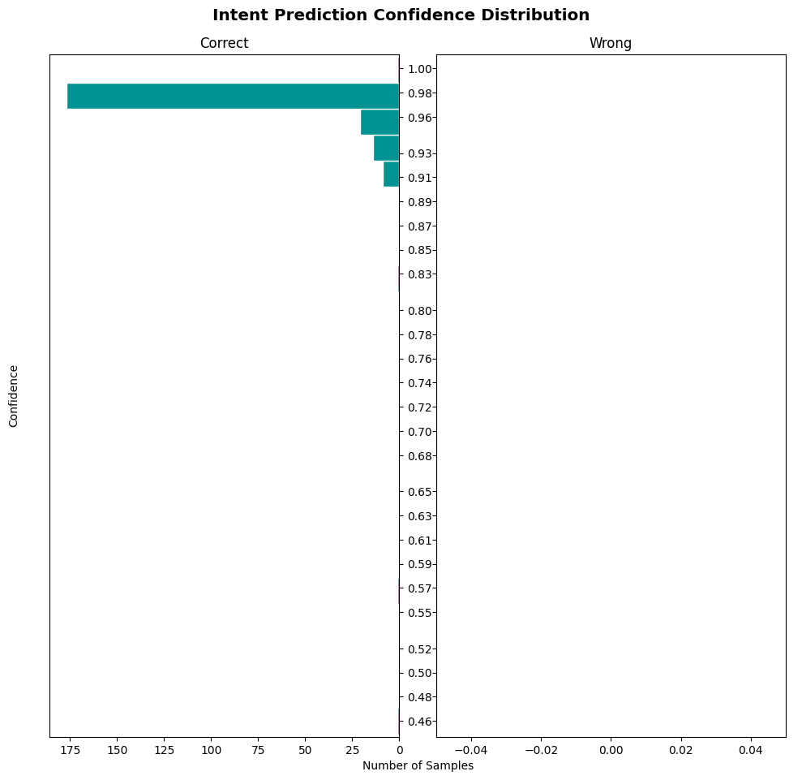

# Como testar as entradas do bot e respostas

Este é um tutorial que visa a ferramente do proprio rasa para testar as entradas do usuarios com as resposta do bot.

### Preparando

Certifique-se que voce está na pasta de `bot/tests/` e ir no arquivo `test_stories.yml` .

Neste `test_stories.yml` crie sua história e coloque a intenção do usuário `user` insira a frase do usuario e insira as intenções(`intent`) do usuario e as ações(`action`) do bot.

    stories:
    - story: inicio conversa
      steps:
      - user: |
          oi
        intent: start
      - action: utter_cumprimentar

### Posteriormente faça o teste

Usando o comando abaixo.

    make test

Com isso o make test gera a pasta `bot/results` nesta pasta tera 3 pngs importantes para ver se todos os testes foram concluidos.

Se estiver tudo certo com a imagem ela gerara uma matriz em diagonal chamada (`intent_confusion_matrix.png`) .

Se não aparecera algum quadrado fora da diagonal com um numero.

<h1 align="center">Matrix de confusão certa</h1>

    

<h1 align="center">Matrix de confusão errada</h1>

    

<h1 align="center">Histograma do bot certo</h1>

    

<h1 align="center">Histograma do bot errado</h1>

    

<h1 align="center">Histórias do bot</h1>

    

